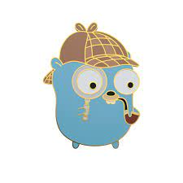

# Sherlock

In agile companies, one still needs a
"Sherlock Holmes" style of log reader.  

In _The Adventure of the Beryl Coronet_, Holmes says 
"It is an old maxim of mine that when you have
excluded the impossible, whatever remains,
however improbable, must be the truth."

By this logic, it is impossible that anything logged
before the error first occurred could be a cause of the error. 
Therefor sherlock reads the log from a failing program, but only show us the new lines, the 
lines that weren't there until _after_ we had the problem. 

The original implementation, 
"antilog", was a batch program run by cron. 
It's more common now to want immediate 
notification. 
Sherlock is therefore a stream program, one that 
can tail multiple logs, remove all the uninteresting 
content, and notify operations
when a new, unexpected message shows up.

It can be used as a background process, a
retrospective log analyzer, a tool to explore logs
interactively or even an old-fashioned cron job,
all using the same basic algorithm. 
